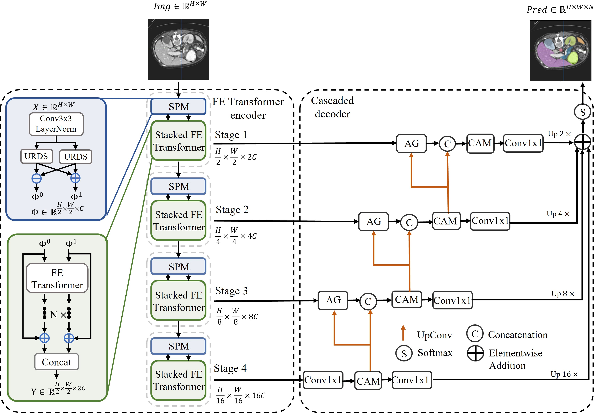
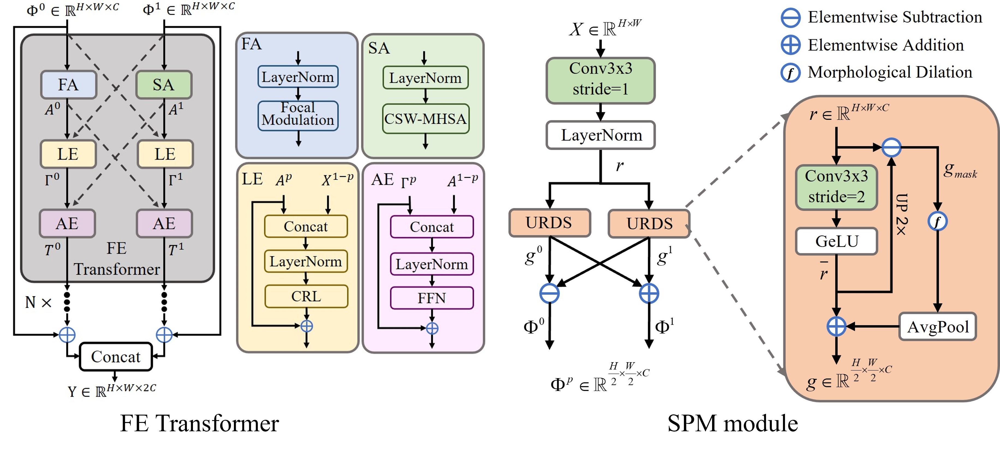

# 🔬 FocalTransNet: A Hybrid Focal-Enhanced Transformer Network for Medical Image Segmentation

[](https://ieeexplore.ieee.org/document/11146468/)
[](https://doi.org/10.1109/TIP.2025.3602739)
[](LICENSE)
[](#-installation)
[](#-installation)

Official implementation of our IEEE Transactions on Image Processing paper:

> **FocalTransNet: A Hybrid Focal-Enhanced Transformer Network for Medical Image Segmentation**<br>
> Miao Liao, Ruixin Yang, Yuqian Zhao, Wei Liang, and Junsong Yuan<br>
> *IEEE Transactions on Image Processing*, 2025, 34:5614-5627<br>
> DOI: [10.1109/TIP.2025.3602739](https://doi.org/10.1109/TIP.2025.3602739)

<p align="center">
  
</p>

---

## 📢 News

- **2025**: FocalTransNet has been accepted by **IEEE Transactions on Image Processing (TIP)**.
- The official IEEE Xplore page is available at [Document 11146468](https://ieeexplore.ieee.org/document/11146468/).

---

## 🔎 Overview

FocalTransNet is a hybrid CNN-Transformer medical image segmentation network. It is designed to combine the locality and detail-preserving strengths of convolution with the long-range dependency modeling ability of Transformer blocks.

The architecture follows an encoder-decoder segmentation paradigm and introduces focal-enhanced feature modeling to better recover fine anatomical structures, organ boundaries, and small lesion regions across multiple medical image segmentation benchmarks.

---

## ✨ Innovations

**FocalTransNet** is a hybrid CNN-Transformer segmentation network designed for high-precision medical image segmentation. It features:

* **Focal-Enhanced (FE) Transformer**: a dual-path module that fuses global self-attention and local convolution with dense cross-connections, enabling complementary local-global representation learning.
* **Symmetric Patch Merging (SPM)**: a downsampling module with an information-compensation mechanism to preserve fine-grained details such as edges, boundaries, and thin structures.
* **Hybrid encoder-decoder design**: a segmentation-oriented architecture that integrates multi-scale semantic information with high-resolution spatial cues.
* **Broad medical segmentation evaluation**: experiments are provided for PDGM, Synapse, SegPC2021, and ISIC2018.

<br>

<p align="center">
  
</p>

---

## ⚙️ Installation

```bash
git clone https://github.com/nemanjajoe/FocalTransNet.git
cd FocalTransNet

# 1) Create environment (example)
conda create -n focaltransnet python=3.9 -y
conda activate focaltransnet

# 2) Install dependencies (strict versions)
pip install -r requirements.txt
```

---

## 📂 Datasets — Download & Prepare

By default we expect all datasets under `./data`. You can change paths in `config.py`. The training scripts will use the dataset-specific sections there.

| Dataset | Download | Expected path |
| --- | --- | --- |
| PDGM | [BaiduNetdisk](https://pan.baidu.com/s/1qIoGpvXzNvDP-bct24gFFg?pwd=6ab9) | `./data/PDGM` |
| Synapse | [BaiduNetdisk](https://pan.baidu.com/s/1uSRgxyPH_2cN3MSfjGhJJw?pwd=s4v7) / [Google Drive](https://drive.google.com/drive/folders/1ACJEoTp-uqfFJ73qS3eUObQh52nGuzCd) | `./data/Synapse` |
| SegPC2021 | [BaiduNetdisk](https://pan.baidu.com/s/1wM435DgkjNZUs280YCRBVA?pwd=3vy2) | `./data/SegPC2021` |
| ISIC2018 | [BaiduNetdisk](https://pan.baidu.com/s/1fRIsZ0gKadCTNHqyF2OBvg?pwd=hfpc) | `./data/ISIC2018` |

---

## 🚀 Quick Start — Training & Evaluation

All hyper-parameters and dataset paths are centralized in `config.py`. The evaluation is automatically executed after training.

### PDGM

```bash
python train_PDGM.py
```

### Synapse

```bash
python train_synapse.py
```

### ISIC 2018

```bash
python train_ISIC2018.py
```

### SegPC 2021

```bash
python train_SegPC2021.py
```

---

## 🗂️ Repository Structure

```text
FocalTransNet/
├── networks/              # Network modules and model definitions
├── figs/                  # Overview and method figures
├── config.py              # Dataset paths and hyper-parameter settings
├── train_PDGM.py          # Training and evaluation on PDGM
├── train_synapse.py       # Training and evaluation on Synapse
├── train_ISIC2018.py      # Training and evaluation on ISIC2018
├── train_SegPC2021.py     # Training and evaluation on SegPC2021
├── utils.py               # Utility functions
├── logger.py              # Logging utilities
└── requirements.txt       # Python dependencies
```

---

## ✅ To Reproduce

1. Install the dependencies following the [Installation](#️-installation) section.
2. Download the preprocessed datasets and place them under the expected paths.
3. Check dataset paths, training settings, and hyper-parameters in `config.py`.
4. Run the corresponding training script for the dataset of interest.
5. Evaluation is automatically executed after training.

---

## 📜 Citation

If you use this code or find it helpful, please cite:

```bibtex
@article{liao2025focaltransnet,
  title   = {FocalTransNet: A Hybrid Focal-Enhanced Transformer Network for Medical Image Segmentation},
  author  = {Liao, Miao and Yang, Ruixin and Zhao, Yuqian and Liang, Wei and Yuan, Junsong},
  journal = {IEEE Transactions on Image Processing},
  volume  = {34},
  pages   = {5614--5627},
  year    = {2025},
  doi     = {10.1109/TIP.2025.3602739}
}
```

---

## 🙏 Acknowledgements

This work was supported in part by the National Natural Science Foundation of China, the Science and Technology Innovation Program of Hunan Province, and the Scientific Research Fund of the Hunan Provincial Education Department.

We thank the authors of [TransUNet](https://github.com/Beckschen/TransUNet), [CSWin-Transformer](https://github.com/microsoft/CSWin-Transformer), and [CASCADE](https://github.com/SLDGroup/CASCADE) for releasing their code.

---

## 📄 License

This project is released under the **MIT License**. See [`LICENSE`](LICENSE) for details.

---
